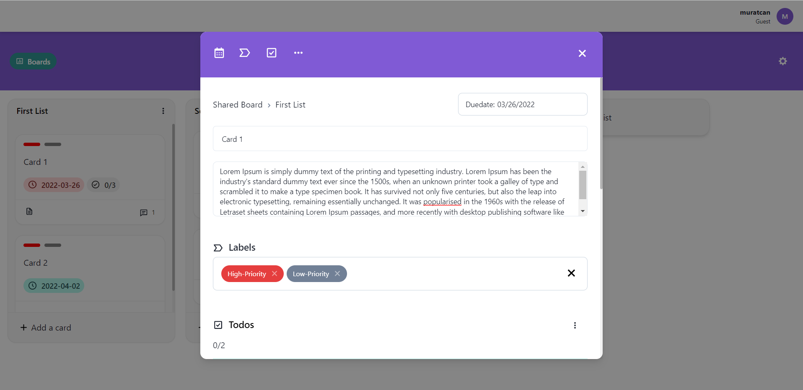

# E-Çözüm Final Project Kanban APP

This project is a Kanban App and is built for E-Çözüm & Patika Bootcamp Final Project.

## Technologies used in this project

- React
- Typescript
- Redux-Toolkit
- Redux-Thunk
- React-Router
- Axios
- Chakra-UI

## Previews

- ## Register - Login

- ## Boards List

- ## Board Details

- ## Card Details

- ## Board Settings

